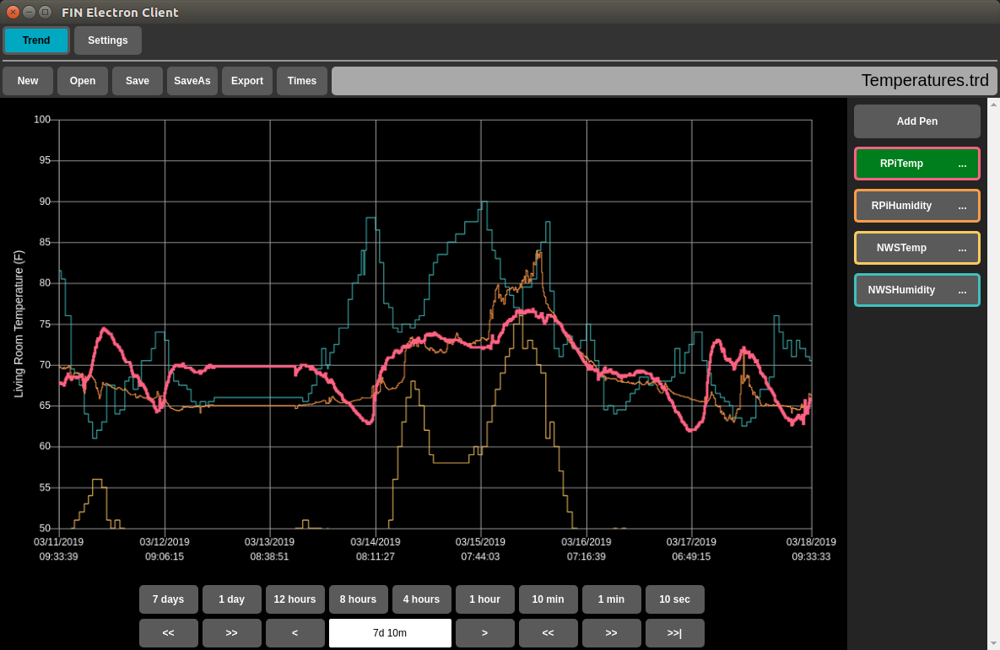
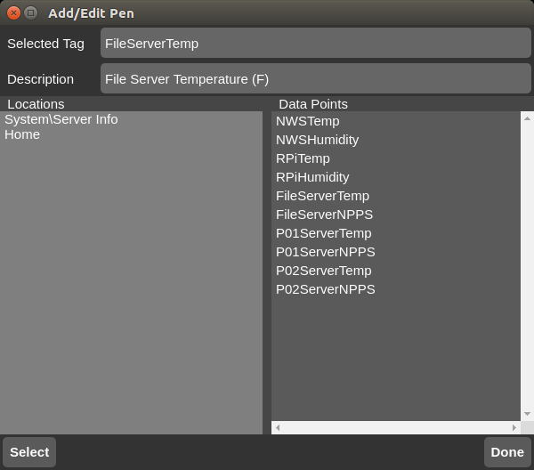
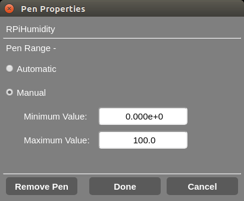
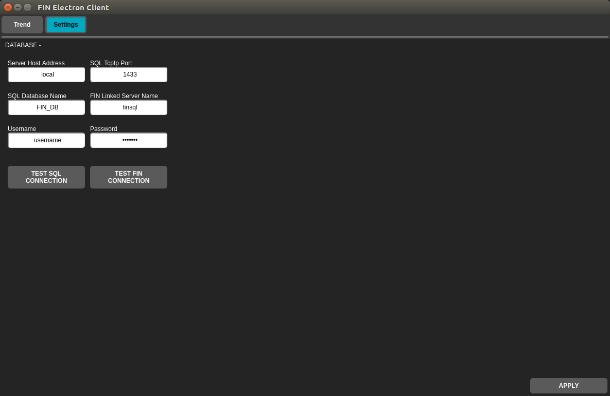
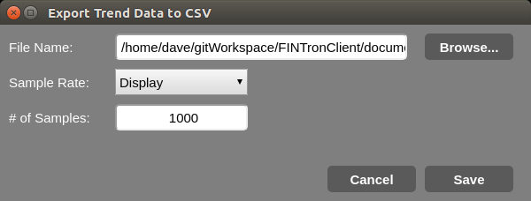
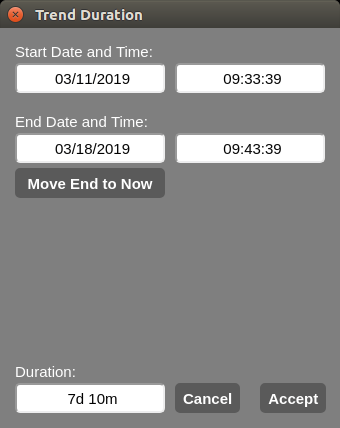

# FIN Electron Client
A simple Electron application for querying and trending FIN (Factory Intelligence Network) historical data using a MSSQL ODBC linked server.

## Factory Intelligence Network
Factory Intelligence Network (FIN) is a realtime historian for the manufacturing plant floor.  More information can be found here:
http://automation-control.com

This application is not directly affiliated with the FIN product and is merely a SQL database client taylored to pull data from a FIN server using the pre-configured ODBC Driver over a linked server using OPENQUERY.  Factory Intelligence Network provides its own FIN Client software which is much more full featured.

Screenshot(s):

Application -

