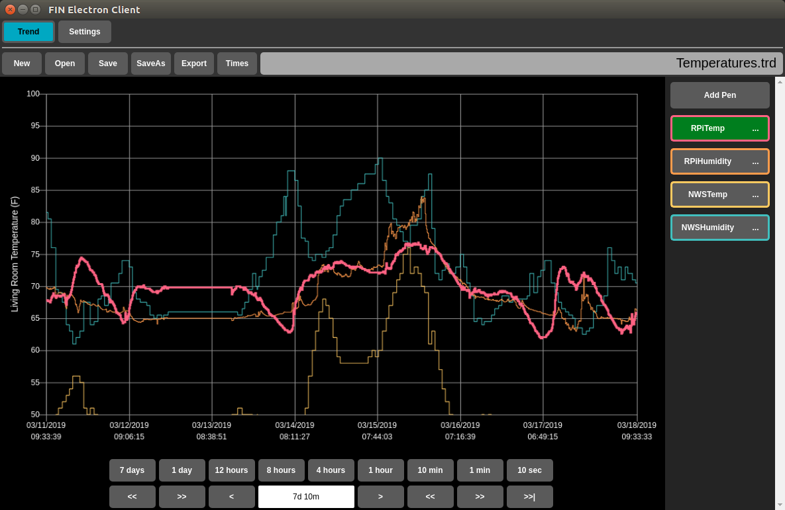
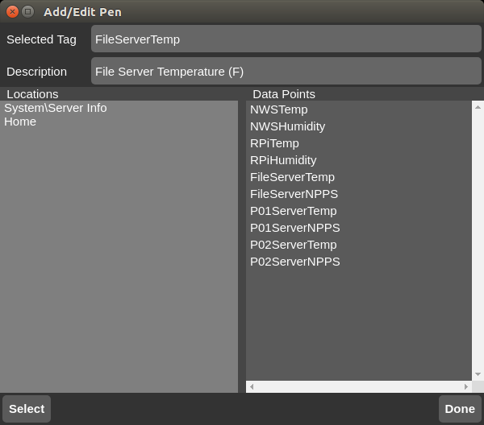
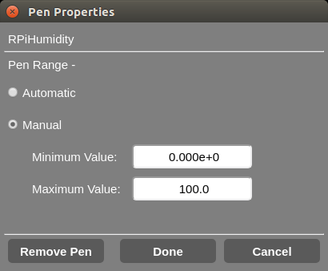
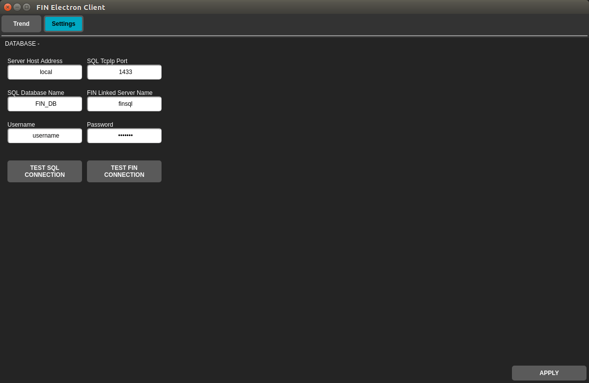
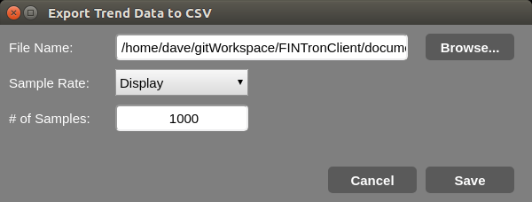
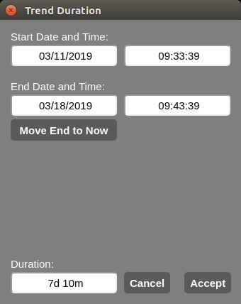

# FIN Electron Client
A simple Electron application for querying and trending FIN (Factory Intelligence Network) historical data using a MSSQL ODBC linked server.

## Factory Intelligence Network
Factory Intelligence Network (FIN) is a realtime historian for the manufacturing plant floor.  More information can be found here:
http://automation-control.com

This application is not directly affiliated with the FIN product and is merely a SQL database client taylored to pull data from a FIN server using the pre-configured ODBC Driver over a linked server using OPENQUERY.  Factory Intelligence Network provides its own FIN Client software which is much more full featured.

Screenshot(s):

Application -













## Building Install Packages

### Prerequisites

- Node.js (v18 or later)
- Run `npm install` from the project root to install all dependencies

### Linux (AppImage and .deb)

Build from a Linux machine:

```bash
npx electron-builder --linux
```

Output files will be in the `dist/` folder:
- `FINTronClient-<version>.AppImage` — portable, runs on any Linux distro
- `FINTronClient_<version>_amd64.deb` — installable via `sudo dpkg -i` on Ubuntu/Debian

### Windows (NSIS installer)

Build from a Windows machine:

```bash
npx electron-builder --win
```

Output file will be in the `dist/` folder:
- `FINTronClient Setup <version>.exe` — NSIS installer for Windows

**Note:** Windows installers should be built on a Windows machine. Cross-compiling from Linux is not reliably supported.
